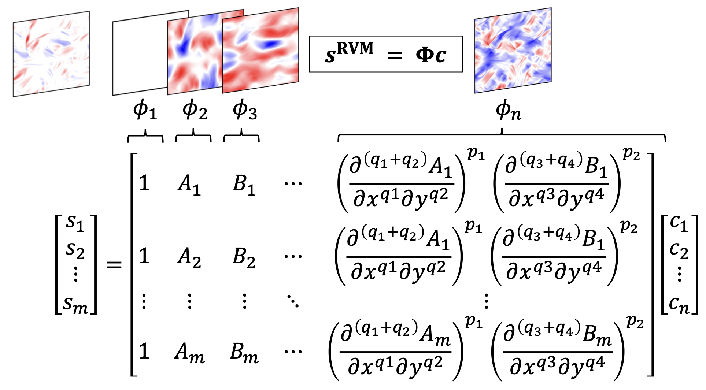

# Equation discovery for 2D-FHIT and RBC

Discover subgrid-scale (SGS) momentum flux closures for 2D forced homogeneous isotropic turbulence (FHIT) and 2D turbulent Rayleigh-Bénard convection (RBC), and SGS heat flux closures for RBC.




## Table of contents

* [Introduction](#Introduction)
* [Installation](#Installation)
* [Requirements](#Requirements)
* [Data](#Data)
* [Citation](#Citation)
* [References](#References)


## Introduction

There is growing interest in discovering interpretable, closed-form equations for subgrid-scale (SGS) closures (parameterizations) of complex processes in the Earth system. Here, we apply a common equation-discovery technique with expansive libraries to learn closures for SGS fluxes from filtered direct numerical simulations (FDNS) of 2D-FHIT and RBC. Across several common filters, we robustly discover closures of the same form for momentum and heat fluxes. These closures depend on nonlinear combinations of gradients of filtered variables (velocity, temperature), with constants that only depend on the filter type and size. We show that the discovered closures are the nonlinear gradient model (NGM), which is derivable analytically using Taylor-series expansions. In fact, we suggest that with the common approach, regardless of the system and physics of the SGS flux, the discovered closure is always NGM-like, consistent with the Taylor-series. Similar to previous studies, we find that large-eddy simulations with NGM closures are unstable, despite the significant similarity between the true fluxes and the NGM-predicted fluxes (pattern correlations > 0.95). We identify two shortcomings that could be the reasons for these instabilities: in 2D, NGM produces zero kinetic energy transfer between the resolved and subgrid scales, thus lacking both diffusion and backscattering. In RBC, backscattering of potential energy is poorly predicted. Accordingly, to learn accurate, stable closures from high-fidelity data in future work, we propose several ideas around choices of libraries, loss functions, and evaluation metrics. These findings are relevant beyond turbulent flows to closure modeling of any multi-scale, nonlinear system.


## Installation

If you are interested in using this, please clone this repository and run,
```
pip install -e ./
```


## Requirements

- Matlab R2020a+
- python 3.9
	- [scipy](https://pypi.org/project/scipy/)
	- [numpy](https://pypi.org/project/numpy/)
	- [scikit-learn](https://pypi.org/project/scikit-learn/)
	- [h5py](https://pypi.org/project/h5py/)
- RVM from [i]*:
	- [rvm-find](https://github.com/TomBolton/rvm-find)

'*' Included in the eqsdiscovery


## Data

Data used in this work is available at 

```
https://doi.org/10.5281/zenodo.7500647
```


## Citation


## References

Following open-source libraries/codes are used

- \[i\] [rvm-find](https://github.com/TomBolton/rvm-find)
	- Laure Zanna, and Thomas Bolton. "Data-Driven Equation Discovery of Ocean Mesoscale Closures
", Geophysical Research Letters 47, 17 (2020).([url]( https://doi.org/10.1029/2020GL088376))<details><summary>BibTeX</summary><pre>
@article{Zanna_GRL_2020,
	author = {Zanna, Laure and Bolton, Thomas},
	doi = {10.1029/2020GL088376},
	issn = {19448007},
	journal = {Geophysical Research Letters},
	number = 17,
	pages = 1--13,
	title = {Data-Driven Equation Discovery of Ocean Mesoscale Closures},
	volume = 47,
	year = 2020,
}</pre></details>
